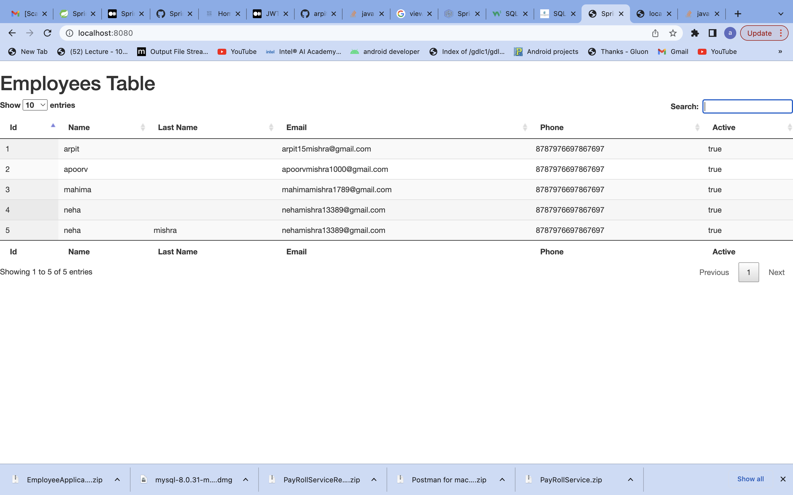

Run as Java Application the EmployeeApplication.java file.

Open → http://localhost:8080/

There are a lot of things that you can do with the DataTables: ordering, searching, rendering, event handlers, localization, etc.
